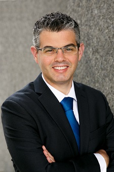

I am a PhD candidate at the Agricultural and Resource Economics department at UC Berkeley. I'm interested in agriculture, energy, the environment, and the links between them. I'm also interested in public and labor economics.

I'm on the job market! Here are my <a href="itai_trilnick_cv.pdf" target="_blank">academic cv</a> and an <a href="trilnick_resume.pdf" target="_blank">industry oriented resume</a>. I have a cool job market paper on climate change and agriculture, <a href="jmp.pdf" target="_blank">click here to read it</a>.

<!--  -->